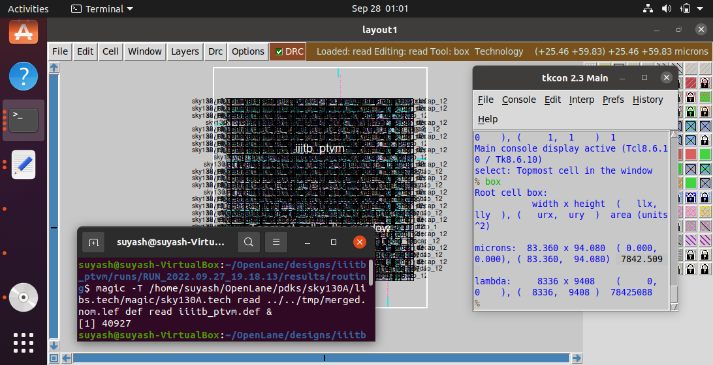

# iiitb_ptvm : Parking Ticket Vending Machine
A parking ticket vending machine simulated in verilog. The coin accepts Rs 5 and 10 coins, and dispenses a Rs 20 ticket when coins of appropriate value are inserted.

## Parking Ticket Vending Machine: an introduction
The machine is implemented using principles of Finite State Machine, which hop across different states while keeping track of the input coins.
For a more thorough discussion, consider reading this: 
https://www.google.com/url?sa=t&rct=j&q=&esrc=s&source=web&cd=&cad=rja&uact=8&ved=2ahUKEwjf-86YzZr5AhUGgVYBHfVIAuAQFnoECAcQAQ&url=http%3A%2F%2Fwww.csun.edu%2F~ags55111%2Fdoc%2F526%2F526report.pdf&usg=AOvVaw3NuGRaAizOTMxRLgdB-8qI


## FSM State diagram


## About iverilog 
Icarus Verilog is an implementation of the Verilog hardware description language.
## About GTKWave
GTKWave is a fully featured GTK+ v1. 2 based wave viewer for Unix and Win32 which reads Ver Structural Verilog Compiler generated AET files as well as standard Verilog VCD/EVCD files and allows their viewing

## How to simulate on host
Use the following commands:
'''
$supo apt install -y git
$sudo apt install iverilog
$sudo apt install gtkwave
$git clone suysh-msra/iiitb_pvtm
$iverilog iiitb_pvtm.v
$vvp ./a.out
$gtkwave ticketvending.vcd
'''
## Input/Output waveforms

Note that these are not the final waveforms, some changes are required to make the machine dispense change at the end of transaction, if required.

# PreSynthesis

To clone the repository, download the netlist files and simulate the results, Enter the following commands in your terminal:

```
 $ git clone https://github.com/suysh-msra/iiitb_ptvm

 $ cd iiitb_ptvm
 
 $ iverilog -o iiitb_ptvm_out.out iiitb_ptvm.v iiitb_ptvm_tb.v
 
 $ ./iiitb_ptvm_out.out
 
 $ gtkwave iiitb_ptvm_vcd.vcd
```


# PostSynthesis

```
$ yosys

yosys> read_liberty -lib ../lib/sky130_fd_sc_hd__tt_025C_1v80.lib

yosys> read_verilog iiitb_ptvm.v

yosys> synth -top iiitb_ptvm

yosys> dfflibmap -liberty ../lib/sky130_fd_sc_hd__tt_025C_1v80.lib

yosys> abc -liberty ../lib/sky130_fd_sc_hd__tt_025C_1v80.lib

yosys> stat

yosys> show

yosys> write_verilog iiitb_ptvm_netlist.v

$ iverilog -DFUNCTIONAL -DUNIT_DELAY=#1 ../verilog_model/primitives.v ../verilog_model/sky130_fd_sc_hd.v iiitb_ptvm_netlist.v iiitb_ptvm_tb.v

$ ./a.out

$ gtkwave iiitb_ptvm_vcd.vcd
```


# Creating a Custom Inverter Cell

Open Terminal in the folder you want to create the custom inverter cell.

```
$ git clone https://github.com/nickson-jose/vsdstdcelldesign.git

$ cd vsdstdcelldesign

$  cp ./libs/sky130A.tech sky130A.tech

$ magic -T sky130A.tech sky130_inv.mag &
```

<br>

The above layout will open. The design can be verified and various layers can be seen and examined by selecting the area of examination and type `what` in the tcl window.

To extract Spice netlist, Type the following commands in tcl window.

```
% extract all

% ext2spice cthresh 0 rthresh 0

% ext2spice
```
`cthresh 0 rthresh 0` is used to extract parasitic capacitances from the cell.<br>


The spice netlist has to be edited to add the libraries we are using, The final spice netlist should look like the following:

```
* SPICE3 file created from sky130_inv.ext - technology: sky130A

.option scale=0.01u
.include ./libs/pshort.lib
.include ./libs/nshort.lib


M1001 Y A VGND VGND nshort_model.0 ad=1435 pd=152 as=1365 ps=148 w=35 l=23
M1000 Y A VPWR VPWR pshort_model.0 ad=1443 pd=152 as=1517 ps=156 w=37 l=23
VDD VPWR 0 3.3V
VSS VGND 0 0V
Va A VGND PULSE(0V 3.3V 0 0.1ns 0.1ns 2ns 4ns)
C0 Y VPWR 0.08fF
C1 A Y 0.02fF
C2 A VPWR 0.08fF
C3 Y VGND 0.18fF
C4 VPWR VGND 0.74fF


.tran 1n 20n
.control
run
.endc
.end
```

Open the terminal in the directory where ngspice is stored and type the following command, ngspice console will open:

```
$ ngspice sky130_inv.spice 
```


Now you can plot the graphs for the designed inverter model.

```
-> plot y vs time a
```

<br>

Four timing parameters are used to characterize the inverter standard cell:<br>

1. Rise time: Time taken for the output to rise from 20% of max value to 80% of max value<br>
        `Rise time = (2.23843 - 2.17935) = 59.08ps`
2. Fall time- Time taken for the output to fall from 80% of max value to 20% of max value<br>
        `Fall time = (4.09291 - 4.05004) = 42.87ps`
3. Cell rise delay = time(50% output rise) - time(50% input fall)<br>
        `Cell rise delay = (2.20636 - 2.15) = 56.36ps`  
4. Cell fall delay  = time(50% output fall) - time(50% input rise)<br>
        `Cell fall delay = (4.07479 - 4.05) = 24.79ps`
        
To get a grid and to ensure the ports are placed correctly we can use
```
% grid 0.46um 0.34um 0.23um 0.17um
```


To save the file with a different name, use the folllowing command in tcl window
```
% save sky130_vsdinv.mag
```

Now open the sky130_vsdinv.mag using the magic command in terminal
```
$ magic -T sky130A.tech sky130_vsdinv.mag
```
In the tcl command type the following command to generate sky130_vsdinv.lef
```
$ lef write
```
A sky130_vsdinv.lef file will be created.


# Layout

## Preparation
The layout is generated using OpenLane. To run a custom design on openlane, Navigate to the openlane folder and run the following commands:<br>
```
$ cd designs

$ mkdir iiitb_ptvm

$ cd iiitb_ptvm

$ mkdir src

$ touch config.json

$ cd src

$ touch iiitb_ptvm.v
```

The iiitb_ptvm.v file should contain the verilog RTL code you have used and got the post synthesis simulation for. <br>

Copy  `sky130_fd_sc_hd__fast.lib`, `sky130_fd_sc_hd__slow.lib`, `sky130_fd_sc_hd__typical.lib` and `sky130_vsdinv.lef` files to `src` folder in your design. <br>

The final src folder should look like this: <br>

 <br>

The contents of the config.json are as follows. this can be modified specifically for your design as and when required. <br>

As mentioned by Kunal sir dont use defined `DIE_AREA` and `FP_SIZING : absolute`, use `FP_SIZING : relative`
```
{
    "DESIGN_NAME": "iiitb_ptvm",
    "VERILOG_FILES": "dir::src/iiitb_ptvm.v",
    "CLOCK_PORT": "clkin",
    "CLOCK_NET": "clkin",
    "GLB_RESIZER_TIMING_OPTIMIZATIONS": true,
    "CLOCK_PERIOD": 10,
    "PL_TARGET_DENSITY": 0.7,
    "FP_SIZING" : "relative",
    "pdk::sky130*": {
        "FP_CORE_UTIL": 30,
        "scl::sky130_fd_sc_hd": {
            "FP_CORE_UTIL": 20
        }
    },
    
    "LIB_SYNTH": "dir::src/sky130_fd_sc_hd__typical.lib",
    "LIB_FASTEST": "dir::src/sky130_fd_sc_hd__fast.lib",
    "LIB_SLOWEST": "dir::src/sky130_fd_sc_hd__slow.lib",
    "LIB_TYPICAL": "dir::src/sky130_fd_sc_hd__typical.lib",  
    "TEST_EXTERNAL_GLOB": "dir::../iiitb_ptvm/src/*"


}
```


Save all the changes made above and Navigate to the openlane folder in terminal and give the following command :<br>

```
$ make mount 
```

After entering the openlane container give the following command:<br>
```
$ ./flow.tcl -interactive
```


This command will take you into the tcl console. In the tcl console type the following commands:<br>


```
% package require openlane 0.9
```
<br>
```
% prep -design iiitb_ptvm
```

The following commands are to merge external the lef files to the merged.nom.lef. In our case sky130_vsdiat is getting merged to the lef file <br>
```
set lefs [glob $::env(DESIGN_DIR)/src/*.lef]
add_lefs -src $lefs
```

The contents of the merged.nom.lef file should contain the Macro definition of sky130_vsdinv <br>
<br>


## Synthesis
```
% run_synthesis
```

### Synthesis Reports
Details of the gates used <br>
<br>


Setup and Hold Slack after synthesis<br>
<br>


<br>
```
Flop Ratio = Ratio of total number of flip flops / Total number of cells present in the design = 4/25 = 0.16
```
<br>
The sky130_vsdinv should also reflect in your netlist after synthesis <br>
<br>


## Floorplan
```
% run_floorplan
```

### Floorplan Reports
Die Area <br>
<br>


<br>
Core Area <br>
<br>

Navigate to results->floorplan and type the Magic command in terminal to open the floorplan <br>
```
$ magic -T /home/suyash/OpenLane/pdks/sky130A/libs.tech/magic/sky130A.tech read ../../tmp/merged.nom.lef def read iiitb_ptvm.def &
```
<br>
<br>
Floorplan view <br>
<br>

<br>
<br>


## Placement
```
% run_placement
```
<br>

### Placement Reports
Navigate to results->placement and type the Magic command in terminal to open the placement view <br>
```
$ magic -T /home/suyash/OpenLane/pdks/sky130A/libs.tech/magic/sky130A.tech read ../../tmp/merged.max.lef def read iiitb_ptvm.def &
```

<br>
Placement View <br>
<br>
<br>
<br>
<br>
<br>
<b>sky130_vsdinv</b> in the placement view :<br>
<br>
<br>
<br>
The sky130_vsdinv should also reflect in your netlist after placement <br>
<br>
<br>

## Clock Tree Synthesis
```
% run_cts
```
<br>

## Routing
```
% run_routing
```
<br>

### Routing Reports
Navigate to results->routing and type the Magic command in terminal to open the routing view <br>
```
$ magic -T /home/suyash/OpenLane/pdks/sky130A/libs.tech/magic/sky130A.tech read ../../tmp/merged.nom.lef def read iiitb_ptvm.def &
```
<br>
<br>
Routing View<br>
<br>
<br>
<br>
<br>
<br>
<b>sky130_vsdinv</b> in the routing view :<br>
<br>
<br>
<br>
Area report by magic :<br>
<br>
<br>
<br>
The sky130_vsdinv should also reflect in your netlist after routing <br>
<br>
<br>

## Viewing Layout in KLayout

 <br>

<br>

<br>


### NOTE
We can also run the whole flow at once instead of step by step process by giving the following command in openlane container<br>
```
$ ./flow.tcl -design iiitb_ptvm
```
<br>
<br>
All the steps will be automated and all the files will be generated.<br>

we can open the mag file and view the layout after the whole process by the following command, you can follow the path as per the image.<br>

```
$ magic -T /home/suyash/OpenLane/pdks/sky130A/libs.tech/magic/sky130A.tech iiitb_ptvm.mag &
```
<br>

<br>
<br>
<br>


## Applications
Besides using the machine for dispensing tickets, the code can be modified to simulate other, similar FSMs.


## Contributors
- Suyash Misra
- Kunal Ghosh
- Nandini Dantu Devi
- Yash Kothari
- Tejas BN
- Aman Prajapati
- Pankaj

## Acknowledgments


- Kunal Ghosh, Director, VSD Corp. Pvt. Ltd.

## Contact Information

- Suyash Misra, Postgraduate Student, International Institute of Information Technology, Bangalore  suysh.msra@gmail.com
- Kunal Ghosh, Director, VSD Corp. Pvt. Ltd. kunalghosh@gmail.com
